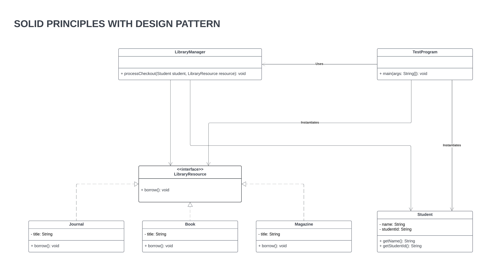

# Laboratory Assignment 6
This is Laboratory Assignment 6 for the course, Software Engineering 2, taken during the Second Semester of Academic Year 2025-2026 at New Era University.

## Problem Statement

The **NEU Library** offers a variety of resources, including books, theses, capstones, internet access, journals, and newspapers.

Currently, the **Student** object has methods like **borrowBook()**, **borrowJournal()** with a parameter of **title**, which directly depend on specific resource types.

To adhere to the **Dependency Inversion Principle (DIP)** and ensure flexibility for future changes (such as introducing audio books or e-journals), we need to refactor the program while maintaining **SOLID principles**. The goal is to create a robust system that can seamlessly accommodate new resource types in the future.

Your solution should not violate other **SOLID principles**.

Make sure you have a **TestProgram** that will validate the proposed refactored codes.

## Program Implementation
The system uses the **Strategy Pattern** via a `LibraryResource` interface, allowing different items like books or internet terminals to execute their specific behaviors interchangeably. By injecting these resources directly into the `LibraryManager`, the application remains loosely coupled and highly flexible at runtime. Furthermore, the `LibraryManager` acts as a **Facade** by hiding complex validation and checkout logic behind a single, simplified method so the main program does not have to orchestrate those steps.

### Student (Class)
- **Description**: Represents a student in the library system. Contains student information such as name and student ID. Does not handle borrowing logic directly.
- **SOLID Principles**:
  - **SRP**: Has a single responsibility of managing student data (name and ID).
  - **OCP**: Can be extended for additional student attributes without modifying existing borrowing logic.
  - **DIP**: Does not depend on specific resource types, keeping it decoupled from the borrowing mechanism.

### LibraryManager (Class)
- **Description**: Manages the checkout process by connecting students with library resources. It handles verification and orchestrates the borrowing process.
- **SOLID Principles**:
  - **SRP**: Responsible solely for managing the checkout process and student verification.
  - **OCP**: Open for extension (new verification steps can be added) but closed for modification of existing functionality.
  - **DIP**: Depends on abstractions (`Student` and `LibraryResource`) rather than concrete implementations, allowing for easy substitution of different student types or resource types.

### LibraryResource (Interface)
- **Description**: Defines the contract for library resources that can be borrowed. It provides a single method `borrow()` that encapsulates the borrowing behavior.
- **SOLID Principles**:
  - **SRP**: Has a single responsibility of defining the borrowing interface.
  - **ISP**: Provides a minimal interface with only the necessary method for borrowing.
  - **DIP**: Serves as an abstraction that high-level modules can depend on instead of concrete implementations.

### Book (Class)
- **Description**: Represents a book resource in the library. It implements the `LibraryResource` interface and provides specific borrowing behavior for books.
- **SOLID Principles**:
  - **SRP**: Responsible only for representing a book and its borrowing behavior.
  - **OCP**: The class is closed for modification but the system is open for extension through the interface.
  - **LSP**: Can be substituted wherever a `LibraryResource` is expected without affecting correctness.
  - **DIP**: Depends on the abstraction (`LibraryResource`) rather than being depended upon directly.

### Journal (Class)
- **Description**: Represents a journal resource in the library. Similar to `Book`, it implements the `LibraryResource` interface with specific borrowing behavior for journals.
- **SOLID Principles**:
  - **SRP**: Responsible only for representing a journal and its borrowing behavior.
  - **OCP**: Closed for modification, allows extension through the interface.
  - **LSP**: Fully substitutable for `LibraryResource`.
  - **DIP**: Depends on the abstraction rather than concrete dependencies.

### Magazine (Class)
- **Description**: Represents a magazine resource in the library. Like `Book` and `Journal`, it implements the `LibraryResource` interface, demonstrating low coupling by allowing new resource types to be added without modifying existing code.
- **SOLID Principles**:
  - **SRP**: Responsible only for representing a magazine and its borrowing behavior.
  - **OCP**: Closed for modification, allows extension through the interface.
  - **LSP**: Fully substitutable for `LibraryResource`.
  - **DIP**: Depends on the abstraction rather than concrete dependencies, enabling low coupling.

### TestProgram (Class)
- **Description**: The main class that demonstrates the library system functionality. It creates instances of students and resources, then uses the `LibraryManager` to process checkouts.
- **SOLID Principles**:
  - **SRP**: Has a single responsibility of testing and demonstrating the library system.
  - **DIP**: Depends on abstractions through the use of interfaces, making it flexible for testing different implementations.

## Class Diagram

